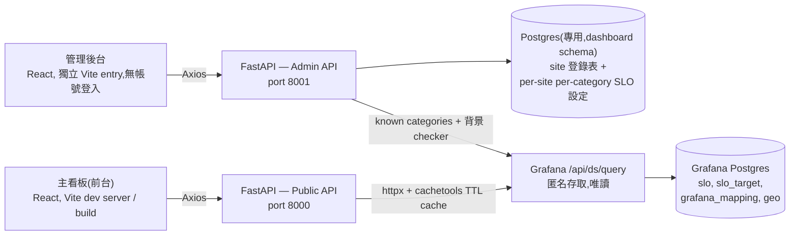

# WWSRE Dashboard — 全球 K8s SLO/SLA 儀表板

一個一眼看出全球各 site Kubernetes SLO/SLA 現況的儀表板網站,並附一個獨立、輕量的後台管理頁面,用來管理「要追蹤哪些 site」以及「各自的 SLO 目標值」。

資料即時從既有的 Grafana 實例讀取,我們不自建/不重複建置指標蒐集管線——細節見下方[資料來源](#資料來源)。

## 目前狀態

功能已完整實作並可部署(見下方[部署](#部署docker-image)):Public API、Admin API、主看板前端、後台管理前端都做完,後端 43 個測試、前後台前端共 14 個元件測試全過。逐項可勾選的實作紀錄在 [plan.md](plan.md)。

## 為什麼要做這個

來源 Grafana(實際位址放在 `backend/.env`,不進版控——見下方 `GRAFANA_BASE_URL`)裡已經有原始的 SLO 資料(Postgres 裡的各 site 彙總、本地 cluster 的 Prometheus 即時 SLI),但沒有一個畫面能直接回答「現在全球哪些 site 是健康的」,得一個一個 cluster 的 dashboard 點進去看。這個專案就是要補上這個全球總覽視角,外加一個後台,讓「要追蹤哪些 site」、「SLO 目標值是多少」不用寫死在程式碼裡。

## 架構



- Backend **完全不寫回** Grafana 的 Postgres——我們對那邊只有(也只想要)查詢權限,那是共用的上游基礎設施,同時也被既有的 Grafana dashboard 使用中。
- 我們自己的登錄資料庫是**另一個獨立、專用的 Postgres 實例**(跟上面 Grafana 用的那個完全無關,連線資訊各自獨立——見下方[環境變數](#環境變數backendenv)的 `PG_*`),是「要追蹤哪些 site、怎麼標示它們」的權威登錄表(城市名稱、國家、經緯度這些 Grafana 資料裡沒有的展示資訊),也存每個 site 各 category 的 SLO target 與是否計入平均。即時 SLO 數字仍然每次即時向 Grafana 查詢(經過 TTL cache),**不會**複製一份存進這個登錄資料庫。
- Public API 和 Admin API 拆成兩個 port,讓沒有登入機制的後台可以在網路層(防火牆/內網限制)做存取控制,不用另外做一套帳號系統(部署成單一 image 時則改用 ingress/network policy 做同樣的事,見[部署](#部署docker-image))。
- Admin API process 內還跑一個背景迴圈(`checker_service`,見下方 API 表格的 `/api/admin/findings`),每 5 分鐘掃描一次全部 site,把「沒資料、未達標、category 缺失、cluster 缺 Grafana 連結」這類問題整理成一份 Todo list。結果只存在 process 記憶體裡,不寫 SQLite,重啟就重新累積——這是刻意的取捨,換取不用另外設計持久化/已讀狀態的簡單性。

## 資料來源

所有資料都透過 Grafana 自己的查詢代理(`POST /api/ds/query`)讀取,不直接連資料庫——這座 Grafana 對 search、datasources、query 這些 API 開放匿名讀取,所以 backend 只需要知道 `GRAFANA_BASE_URL`,不需要帳密。

相關的 Postgres 資料表(datasource 名稱 `K8S-SRE-Postgres-SQL`):

| 資料表 | 用途 |
|---|---|
| `slo` | 每個 `cluster_id` × `category`(如 `K8S-Node`、`K8S-ETCD`、`K8S-API SERVER` 等)的每日/每週 `min_slo`——真正的營運歷史數據 |
| `slo_target` | 各分類的 SLO 目標值(目前全域統一 99.0%) |
| `grafana_mapping` | `cluster_id` → 該 cluster 自己的 Grafana 網址(用來做「查看即時明細」的外部連結) |
| `geo` | site 代碼、經緯度,以及一個 `SLO` 快照欄位——**這個 `SLO` 欄位實測跟 `slo` 表算出來的最新值對不上、疑似沒在維護,不要拿它當現況依據,只能當經緯度查詢用(或乾脆改用我們自己 Postgres 的登錄表)。** |

即時 Prometheus SLI(CPU、ETCD 延遲、API server 錯誤率等各元件的即時 gauge)只有這座 Grafana本地那一個 cluster 查得到——其餘 cluster 各自有獨立的 Grafana/Prometheus(透過 `grafana_mapping.url` 連結),backend 不會直接查詢它們。

實際追蹤哪些 site(代碼、城市、國家、經緯度)屬於機密資訊,**不寫在這份文件或任何進版控的檔案裡**——真實清單放在 `backend/site_registry.seed.json`(gitignored),格式範例見 `backend/site_registry.seed.example.json`。

## 技術棧

| 分層 | 技術 | 選用原因 / 用法備註 |
|---|---|---|
| Backend 語言 | Python 3.11 | |
| Backend 框架 | FastAPI | async 原生支援,搭配 `httpx.AsyncClient` 打 Grafana API 不會卡住 event loop |
| Backend 套件管理 | uv | `uv init` / `uv add` / `uv run`,鎖檔用 `uv.lock` |
| 設定與驗證 | pydantic-settings | 從 `.env` 讀 `Settings`,啟動時就做型別驗證,設定值錯誤直接啟動失敗而不是執行到一半才炸 |
| Grafana 查詢快取 | cachetools(`TTLCache`) | 依「查詢字串(SQL/PromQL)」當 cache key,避免前端輪詢時每次都直接打 Grafana;TTL 由 `CACHE_TTL_SECONDS` 設定 |
| 登錄資料庫 | Postgres(`asyncpg`) | 專用的獨立 Postgres 實例(跟 Grafana 用的那個無關),連線池由 `app/db.py` 管理,`search_path` 指到 `PG_SCHEMA` 設定的 schema;只存 site 登錄表跟 per-site per-category SLO 設定,不存即時指標(那些永遠現查 Grafana) |
| 前端語言 | TypeScript | |
| 前端框架 | React 19 | |
| 路由 | TanStack Router(file-based) | 用檔案系統決定路由,型別安全的路由參數(如 `/sites/$code`) |
| 資料抓取 | TanStack Query | `useQuery`/`useMutation`,自動輪詢(60 秒)+ 快取,兩個前端都用同一套 |
| 世界地圖 | d3-geo + topojson-client | 真實世界地圖 topojson,動態投影與版面配置(見 `frontend/src/lib/siteProjection.ts`) |
| 樣式 | Tailwind CSS | 深/淺主題用 CSS 變數 token 做(`index.css` 的 `@theme` + `:root[data-theme="light"]` 覆寫),元件一律吃 `bg-canvas`/`text-ink` 這類語意 class,不直接寫死 `neutral-xxx`;`ThemeToggle`(主看板右上角)切換,選擇存 `localStorage`,預設深色 |
| HTTP client | Axios | 前端統一透過一個 Axios instance(`lib/api.ts`)打自己的 backend,不直接打 Grafana |
| 圖示 | lucide-react | |
| 打包工具 | Vite | 前台、後台各自獨立的 Vite 專案(兩個 `package.json`) |
| 測試 | pytest + pytest-asyncio(後端)| service 層邏輯用 mock 過的 `GrafanaClient` 測,不必每次測試都真的打 Grafana |

## 資料模型(Postgres)

登錄資料庫是一個獨立、專用的 Postgres 實例(連線資訊 `PG_HOST`/`PG_PORT`/`PG_USER`/`PG_PASSWORD`/`PG_DATABASE`/`PG_SCHEMA`,見下方[環境變數](#環境變數backendenv)),跟 Grafana 自己用的 Postgres 完全無關。`app/db.py`'s `init_db()` 啟動時自動 `CREATE SCHEMA IF NOT EXISTS` + 建表(idempotent),連線池的每個連線都把 `search_path` 設成 `PG_SCHEMA`,所以下面的 SQL 都不用寫 schema 前綴:

```sql
-- site 登錄表:我們自己維護的「要追蹤哪些 site」清單
CREATE TABLE sites (
    code            TEXT PRIMARY KEY,   -- 例如 'ABC',對應 Grafana cluster_id 前綴
    display_name    TEXT NOT NULL,      -- 城市顯示名稱,如 'Example City'
    country         TEXT NOT NULL,
    latitude        DOUBLE PRECISION NOT NULL,
    longitude       DOUBLE PRECISION NOT NULL,
    cluster_prefix  TEXT NOT NULL,      -- 對應 Grafana slo.cluster_id 的 LIKE 前綴,如 'abc'
    enabled         BOOLEAN NOT NULL DEFAULT true,  -- 停用後不在主看板顯示
    created_at      TIMESTAMPTZ NOT NULL,
    updated_at      TIMESTAMPTZ NOT NULL
);

-- 每個 site、每個 category(K8S-Node/ETCD/ArgoCD/...)各自的 SLO 設定。
-- 一個 site 「現在的 SLO」= 該 site 底下所有 included=true 的 category 的
-- 即時數值平均;「target」= 同一組 included 分類的 target_pct 平均——
-- 兩者用同一組分類算,才有意義互相比較。
-- 沒有出現在這張表的 (site, category) 組合,視同 target_pct=99.0、included=true。
CREATE TABLE site_category_targets (
    site_code   TEXT NOT NULL REFERENCES sites(code),
    category    TEXT NOT NULL,
    target_pct  DOUBLE PRECISION NOT NULL DEFAULT 99.0,
    included    BOOLEAN NOT NULL DEFAULT true,  -- 是否計入該 site 的 SLO 平均
    updated_at  TIMESTAMPTZ NOT NULL,
    PRIMARY KEY (site_code, category)
);
```

`init_db()` 只建 schema/表,**不會**灌入任何資料列。首次對一個全新的 Postgres 設定時,執行一次 `uv run python -m app.seed`(在 `backend/` 目錄下)灌入初始清單,實際內容讀取自 `backend/site_registry.seed.json`(gitignored,機密——見上方[資料來源](#資料來源));複製 `backend/site_registry.seed.example.json` 為 `site_registry.seed.json` 並填入真實 site 清單。這個 script 是 idempotent(以 `code`/`(site_code, category)` 判斷,`ON CONFLICT DO NOTHING`),重複執行不會覆蓋既有資料,之後也可以完全不跑,直接在後台 `/admin` 頁面手動新增 site——因為資料存在 Postgres,不是容器本地檔案,admin 的編輯會一直留著,不會因為 pod 重啟或重新部署而消失。

**為什麼「目前 SLO」是「該 site 底下最差 cluster 的分數」,不是分類平均**:早期版本用「有勾選的分類做平均」,理由是避免「整個 site 當週最小值」那種算法在資料不完整時被誤判成還沒跑完而整週略過不採計。但分類平均本身也有一個問題:只要其他分類夠好,單一 cluster 表現不佳會被平均掉,site 卡片跟地圖燈號會顯示「一切正常」,實際上底下某個 cluster 已經在飄零,實際發生過某個 site 六個 cluster 裡有一個明顯偏低,但分類平均後 site 卡片仍顯示接近 100%,問題完全看不出來。現在改成「該 site 所有 cluster 裡,最新一天分數最差的那一個」,site 卡片、地圖燈號、KPI「Meeting target / Breaching SLO」計數、detail 頁面的 Current SLO 全部套用同一套邏輯,不會再被平均掩蓋。哪個 cluster、哪個 category 拖累分數,可以在 site detail 頁面把滑鼠移到該 cluster 卡片上看 tooltip(呼叫 `/api/public/clusters/{cluster_id}/categories`)。趨勢圖(`history`)仍然是分類週平均,只用來看長期走勢,跟「目前」這個數字是兩件事。

同樣的道理也套用在主看板的「Global SLO trend」:這個數字不是直接拿 `/api/public/trend`(跨 Grafana 全庫、含未登錄的 cluster)的最新一點,而是前端另外算「所有有資料的登錄 site,各自 current_pct(已經是各自最差 cluster)的平均」——沒有資料的 site 不計入。原本直接用全庫平均時,即使某些 site 明顯偏低,全庫平均下來還是會四捨五入顯示成「100.0%」,看起來像假的。

## 環境變數(`backend/.env`)

`.env` 不進版控,啟動前照 `backend/.env.example` 複製一份填入實際值——真實的 Grafana 位址與 datasource uid 只存在這份本機檔案裡。

| 變數 | 說明 | 範例 |
|---|---|---|
| `GRAFANA_BASE_URL` | Grafana 實例位址(機密,只在 `.env`) | `http://<internal-grafana-host>:3000` |
| `GRAFANA_POSTGRES_DATASOURCE_UID` | Postgres datasource 的 uid(機密,只在 `.env`) | `<postgres-datasource-uid>` |
| `GRAFANA_PROMETHEUS_DATASOURCE_UID` | 本地 cluster 的 Prometheus datasource uid(機密,只在 `.env`) | `<prometheus-datasource-uid>` |
| `LOCAL_CLUSTER_ID` | 這座 Grafana 能查到即時 SLI 的那個 cluster_id(機密,只在 `.env`) | `<local-cluster-id>` |
| `CACHE_TTL_SECONDS` | Grafana 查詢結果快取秒數 | `90` |
| `PG_HOST` | 登錄資料庫 Postgres 主機(機密,只在 `.env`,跟 Grafana 用的 Postgres 是不同實例) | `<dedicated-postgres-host>` |
| `PG_PORT` | 登錄資料庫 Postgres port | `5432` |
| `PG_USER` | 登錄資料庫帳號(機密,只在 `.env`) | `<pg-user>` |
| `PG_PASSWORD` | 登錄資料庫密碼(機密,只在 `.env`) | `<pg-password>` |
| `PG_DATABASE` | 登錄資料庫的 database 名稱 | `<pg-database>` |
| `PG_SCHEMA` | 登錄資料庫的 schema 名稱(連線池 `search_path` 會指向這裡) | `dashboard` |
| `PUBLIC_API_PORT` | Public API 監聽 port | `8000` |
| `ADMIN_API_PORT` | Admin API 監聽 port | `8001` |

## 專案目錄結構

```
backend/
  app/
    config.py                    # pydantic-settings
    cache.py                     # cachetools TTLCache 包裝 + stale-fallback
    grafana_client.py            # httpx client,包 /api/ds/query
    db.py                        # Postgres 連線池與 schema 初始化
    seed.py                      # site 初始資料灌入腳本
    sql_safety.py                # 拼進 Grafana rawSql 前的識別字元驗證(防注入)
    dependencies.py               # FastAPI Depends(GrafanaClient/Settings)
    schemas.py                    # pydantic request/response models
    services/
      slo_service.py             # 整合 site 登錄表 + 即時 Grafana 資料,tier/target 計算
      slo_target_service.py      # per-site per-category SLO 設定讀寫
      site_admin_service.py      # site CRUD
      live_service.py            # 即時 Prometheus SLI(僅本地 cluster)
      checker_service.py         # 背景掃描邏輯,產生 admin Todo list(見上方架構說明)
    routers/
      public.py                  # /api/public/*
      admin.py                   # /api/admin/*
    main_public.py                # uvicorn entrypoint,port 8000
    main_admin.py                 # uvicorn entrypoint,port 8001
  tests/
frontend/
  src/
    routes/                      # TanStack Router file-based 路由(index、sites.$code）
    components/
      WorldMap.tsx                # 世界地圖:國家上色、國家/海洋 hover 名稱、site pin
      ScaleToFit.tsx               # 整頁等比例縮放
      ConnectorLine.tsx            # 地圖選點 <-> 卡片的連接線
      TrendChart.tsx / KpiRow.tsx / SiteMiniCard.tsx / Sparkline.tsx / StatusPill.tsx / AppShell.tsx
    lib/
      api.ts                      # Axios instance + 所有 fetch 函式
      siteProjection.ts            # 地圖投影與卡片版面配置計算
      continents.ts / countryNamesZh.ts / oceans.ts   # 地圖上色與中英文名稱對照表
      tier.ts / chart.ts / types.ts
admin-frontend/
  src/                           # 獨立 Vite entry,卡片式 CRUD UI
    App.tsx
    components/SiteCard.tsx / AddSiteCard.tsx / FindingsList.tsx
    lib/api.ts / types.ts
deploy/
  nginx.conf, entrypoint.sh, certs/   # 單一 image 部署用(見下方「部署」)
Dockerfile                        # repo 根目錄,單一 image 三階段 build
```

## API 設計

**Public API(port 8000)**

| Method | Path | 回傳內容 |
|---|---|---|
| GET | `/api/public/sites` | 全部啟用中的 site:代碼、城市、國家、經緯度、目前 SLO(該 site 所有 cluster 裡最新一天分數最差的那一個)、target(有勾選分類的 target 平均)、燈號狀態、近期歷史序列(分類週平均趨勢)、cluster 數量 |
| GET | `/api/public/sites/{code}/clusters` | 該 site 底下各 cluster 的 SLO 明細(跟該 site 自己的 target 比較) |
| GET | `/api/public/sites/{code}/categories` | 該 site 各分類(K8S-Node/ETCD/...)最新一筆的平均與最差 SLO,各自對應該分類在後台設定的 target(目前前端沒有畫面用到,取而代之的是下面單一 cluster 的版本) |
| GET | `/api/public/clusters/{cluster_id}/categories` | **單一 cluster** 自己最新一天的各分類 SLO,target 沿用該 cluster 所屬 site 的後台設定——site detail 頁面 hover 每張 cluster 卡片跳出的 tooltip 就是這支 API |
| GET | `/api/public/categories` | 全域各分類(K8S-Node/ETCD/...)的平均與最差 SLO(跨所有 site,固定用全域預設 target 99.0%) |
| GET | `/api/public/trend` | 全站週趨勢(平均值序列,跨 Grafana 已知的所有 cluster,不限登錄過的 site——只用於趨勢圖的線形,不是任何 KPI 的依據) |
| GET | `/api/public/clusters/count` | Grafana 裡回報進 `slo` 表的 distinct cluster 總數(`{"count": n}`) |
| GET | `/api/public/clusters/{id}/live` | 即時 SLI(僅本地 cluster 有效;其餘回傳 `{"available": false, "external_url": "..."}`) |

以上每個端點的回應都會帶一個 `X-Stale-Data` header(`true`/`false`)。Grafana 打不通時,backend 會回傳上一次成功查詢的結果並標記 `true`,而不是直接讓請求失敗——前端主看板的「live/syncing」燈號在這個情況下會改顯示「stale」。

**Admin API(port 8001)**

| Method | Path | 說明 |
|---|---|---|
| GET | `/api/admin/sites` | 列出全部 site(含停用的) |
| POST | `/api/admin/sites` | 新增 site |
| PATCH | `/api/admin/sites/{code}` | 編輯 site 資訊或啟用/停用 |
| DELETE | `/api/admin/sites/{code}` | 刪除 site |
| GET | `/api/admin/sites/{code}/categories` | 該 site 每個 category 目前的 target_pct 與是否計入平均(沒設定過的 category 回傳預設值 99.0/計入) |
| PUT | `/api/admin/sites/{code}/categories` | 整批覆寫該 site 的 category 設定(送入的清單即為新的完整設定) |
| GET | `/api/admin/findings` | 背景 checker 最近一次掃描的結果(`{"findings": [...], "last_run": "..."}`),每筆 finding 含 severity(warn/crit)、分類(no_data/breach/category_issue/grafana_mapping)、訊息、site/cluster 代碼,以及 `potential_uplift_pct`——這個問題修好後,估計 site 的 current SLO 會提升多少個百分點(算不出來的情況,例如缺 Grafana 連結,固定回傳 0)。同一個根因如果在 site/cluster/category 三層都各產生一筆一樣 uplift 的 finding,只保留最具體(category)那一筆,不重複列 |

目前 `/admin` 這組 API **沒有任何登入/驗證機制**,存取控制完全靠部署層的網路隔離(獨立 port,或部署成同一個 image 時靠 ingress/network policy 限制來源)——細節見下方[部署](#部署docker-image)。

## 本機開發

```bash
# Backend — Public API
cd backend
uv run uvicorn app.main_public:app --reload --port 8000

# Backend — Admin API(另開一個終端機)
cd backend
uv run uvicorn app.main_admin:app --reload --port 8001

# 前台
cd frontend
npm install
npm run dev            # 預設 http://localhost:5173

# 後台
cd admin-frontend
npm install
npm run dev            # 另一個 Vite port,如 http://localhost:5174
```

**測試**

```bash
cd backend && uv run pytest        # 43 個測試
cd frontend && npm test            # Vitest,元件測試(10 個)
cd admin-frontend && npm test      # Vitest,元件測試(4 個)
```

## 部署(Docker image)

一個 image 就能跑完整套系統:public 前端在 `/`、admin 前端在 `/admin`、兩個 FastAPI backend 各自在容器內部的 8000/8001 port,前面統一由一個 nginx 擋在對外的 8080 port,依路徑分流。完整說明(build/push/run 指令、CA 憑證放置方式)見 [deploy/README.md](deploy/README.md),重點摘要:

- `Dockerfile`(repo 根目錄)三階段 build:public 前端(base path `/`)、admin 前端(base path `/admin/`)、Python 依賴,最後組成單一 image。
- **`backend/.env` 會被直接打進 image**(`Dockerfile` 裡的 `COPY backend/.env ./.env`),執行時不用帶任何環境變數、不用 k8s Secret。這是刻意的取捨,換取部署最簡單、跟本機開發環境長得一模一樣,代價是 image 本身就含有真實的 Grafana 位址/datasource UID、以及登錄資料庫的 Postgres 連線密碼等機密——只有在 Harbor 存取權本身已經是受控/內部的前提下才適用,細節與風險說明見 [deploy/README.md](deploy/README.md)。
- **Site 清單存在專用的 Postgres**,不在 image 裡——啟動時 `init_db()` 只確保 schema/表存在(idempotent),不會灌資料。所以後台 `/admin` 的編輯(改名、停用、新增)會直接留在 Postgres 裡,pod 重啟、重新部署、換 image 版本都不會遺失,也不需要掛任何持久化 volume。
- 如需讓容器信任內部 CA,依 [deploy/certs/README.md](deploy/certs/README.md) 的說明,build 前把憑證放到 `deploy/certs/internal-ca.crt`(gitignored,不進版控)。
- **`/admin` 目前沒有任何存取控制**(沒有登入頁,也沒有網路隔離)——正式對外部署前,務必在 ingress / network policy 那層限制誰能連到這個路徑,不要直接曝露這個 port。
- 真正的 registry 位址與專案路徑屬於內部資訊,不寫在這裡或任何進版控的檔案——build/push 指令用你自己環境的實際值執行,格式參考 `deploy/README.md` 裡的 `<your-registry>/<your-project>` 佔位符。

## 開發路線圖

逐項可勾選清單見 [plan.md](plan.md);以下是各階段的重點:

1. **地基**——repo 骨架(uv + Vite)、設定檔、Postgres schema 與 site 清單的 seed script
2. **Backend 唯讀資料層**——`GrafanaClient`、TTL cache、整合登錄表與即時 SLO 的 `slo_service`
3. **Public API**——`/api/public/sites`、`/sites/{code}/clusters`、`/categories`、`/trend`、`/clusters/{id}/live`
4. **Admin API**——site 的 CRUD、per-site per-category SLO 設定讀寫,port 8001
5. **主看板前端**——世界地圖(`d3-geo` + 真實 topojson,動態投影與版面配置,國家依五大洲上色,滑鼠移到國家或海洋上都會顯示中英文名稱)、KPI 列、Global SLO trend(登錄 site 的 current_pct 平均,忽略沒資料的 site)、site 卡片網格(右側固定張數 + 下方其餘,地圖與選點連線互動,連線起點精準對齊圖上的圓點,卡片下方即時顯示該 site 的概算當地時間——以經度概算 UTC 偏移,非真正的行政時區)、整頁等比例縮放(`ScaleToFit`,視窗變窄時文字與版面同步縮小,不跑版,垂直方向不裁切超出正常版面高度的內容如 hover tooltip)、site detail 頁面每張 cluster 卡片 hover 顯示該 cluster 自己 9 個分類的圓環分數、深/淺主題切換(主頁右上角 `ThemeToggle`,全站共用同一個主題、選擇存 `localStorage`,預設深色;淺色不是直接反轉深色配色,是另外調過的淺灰色階跟狀態色對比度)
6. **後台管理前端**——卡片式 CRUD、每個 site 可展開設定 9 個 category 各自的 target 與是否計入平均、無登入機制、獨立打包、Todo list(背景 checker 每 5 分鐘掃描全部 site,列出沒資料/未達標/category 缺失/cluster 缺 Grafana 連結,每筆附「修好後 site SLO 預估提升多少 %」,結果只存記憶體,不持久化)
7. **打磨**——Grafana 連不上時的優雅降級(回傳最後一次快取資料並標記 `stale`)、響應式與無障礙檢查、測試、主看板與後台標題視覺統一(漸層主標題 + 強調色小標)
8. **部署**——單一 Docker image(public `/` + admin `/admin` + 兩個 backend,見上方[部署](#部署docker-image))

## 待確認事項

- `geo.SLO` 資料過時的問題(見[資料來源](#資料來源))要決定:完全忽略,還是去查是哪支排程在寫入、為什麼會跟 `slo` 對不上。
- 「異常·無影響」跟「異常·有影響」的分類門檻,上游沒有明確定義;目前用的是預設門檻(≥target 正常、95–target 無影響、<95 有影響),需要確認是否合理。
- `/admin` 目前完全沒有存取控制,正式對外部署前要決定用什麼方式限制(見[部署](#部署docker-image)裡的提醒)。
